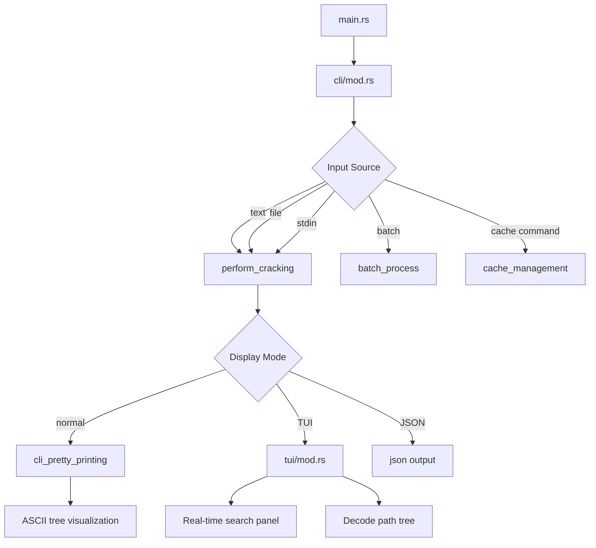

# CLI Enhancement (Tasks 27-31)

Feature Name: cli-enhancement
Updated: 2026-08-23

## Description

Enhance the Ciphey CLI experience with interactive TUI, decode path visualization, file/batch/stdin input, cache management commands, and shell completion support.

## Architecture



## Components and Interfaces

### 27. Interactive TUI (`src/tui/mod.rs`)

**New module** using ratatui for terminal UI.

```rust
pub fn run_tui(input: String, Config) -> Result<Option<DecoderResult>>;

struct TuiApp {
    status: SearchStatus,
    current_decoder: String,
    tried_decoders: Vec<String>,
    results: Vec<RankedResult>,
}

enum SearchStatus {
    Searching,
    FoundResult,
    Failed,
}
```

**Features:**
- Real-time display of current decoder being tried
- Progress bar for search progress
- Panel showing decode path as ASCII tree
- Results panel with confidence scores

### 28. Decode Path Visualization (`cli_pretty_printing/mod.rs`)

**Enhancement** to existing module.

```rust
pub fn display_decode_path(path: &[CrackResult]);
pub fn display_ascii_tree(path: &[CrackResult]);
```

**Output format:**
```
Decoding Path:
├── Base64 decode
├── Hex decode
└── ROT13 decode → "Hello World"
```

### 29. File/Batch/Stdin Input (`cli/mod.rs`)

**Enhancement** to existing CLI.

```rust
pub enum InputSource {
    Text(String),
    File(PathBuf),
    Stdin,
    Batch(Vec<String>),
}
```

**New CLI arguments:**
- `--stdin` - Read from standard input
- `--batch` - Batch mode (one ciphertext per line)
- `--file` - Already exists, extend for multiple files

### 30. Cache Management (`src/cli/mod.rs`)

**New subcommands** for cache management.

```rust
#[derive(Subcommand)]
enum CacheCommand {
    /// Clear all cache entries
    Clear,
    /// Show cache statistics
    Stats,
    /// List recent cache entries
    List { limit: Option<usize> },
}
```

**New CLI arguments:**
- `--cache clear` - Clear cache
- `--cache stats` - Show cache statistics
- `--cache list [N]` - List recent N entries

### 31. Shell Completion (`src/cli/mod.rs`)

**Enhancement** using clap's built-in shell completion.

```rust
#[derive(Subcommand)]
enum CliCommand {
    /// Generate shell completion script
    GenerateCompletion { shell: Shell },
}
```

**Supported shells:** bash, zsh, fish, powershell, elvish

## Data Models

### Cache Stats

```rust
pub struct CacheStats {
    pub total_entries: usize,
    pub successful_entries: usize,
    pub failed_entries: usize,
    pub total_size_bytes: usize,
    pub hit_rate: f32,
}
```

### Batch Result

```rust
pub struct BatchResult {
    pub input: String,
    pub result: Option<DecoderResult>,
    pub index: usize,
}
```

## Correctness Properties

1. TUI mode must not affect non-TUI mode
2. Stdin mode must work with pipes
3. Batch mode must process all lines independently
4. Cache management must not corrupt existing cache
5. Shell completion must work for all defined arguments

## Error Handling

| Error | Handling |
|-------|----------|
| TUI init failure | Fall back to normal mode |
| Stdin empty | Show error message |
| Batch line fail | Continue processing other lines |
| Cache locked | Show retry message |
| Invalid shell | Show supported shells |

## Test Strategy

| Component | Test Type | Coverage |
|-----------|-----------|----------|
| CLI parsing | unit | All new arguments |
| Input source | unit | Text/File/Stdin/Batch |
| Cache commands | integration | Clear/Stats/List |
| Path visualization | unit | ASCII tree format |
| Shell completion | integration | All supported shells |
| TUI module | manual | Visual verification |

## Implementation Order

1. **Task 29**: File/Batch/Stdin Input (foundational, other features depend on it)
2. **Task 30**: Cache Management Commands (independent)
3. **Task 31**: Shell Completion (independent)
4. **Task 28**: Decode Path Visualization (enhances existing output)
5. **Task 27**: Interactive TUI (most complex, builds on others)

## References

- `src/cli/mod.rs` - CLI argument definitions
- `src/cli_pretty_printing/mod.rs` - Output formatting
- `src/storage/database.rs` - Cache database operations
- `src/main.rs` - Program entry point
